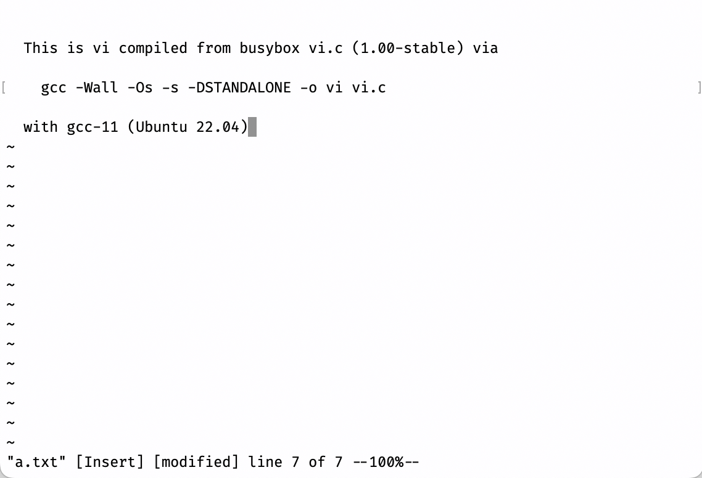

<!DOCTYPE html><html><head><meta charSet="utf-8"/><meta name="viewport" content="width=device-width"/><title>Yanyan&#x27;s Wiki</title><link rel="stylesheet" href="https://cdn.jsdelivr.net/npm/katex@0.16.9/dist/katex.min.css"/><link rel="stylesheet" href="https://cdnjs.cloudflare.com/ajax/libs/highlight.js/11.6.0/styles/default.min.css"/><meta name="next-head-count" content="5"/><link rel="preload" href="../_next/static/css/e993edd6a18ef4f0.css" as="style"/><link rel="stylesheet" href="../_next/static/css/e993edd6a18ef4f0.css" data-n-g=""/><noscript data-n-css=""></noscript></head><body>

<a href="../index.html">Yanyan&#x27;s wiki</a><form class="text-xs text-slate-500"> for <input type="text" name="token" class="font-mono text-xs w-16" maxLength="8"/></form>
<nav class="text-sm leading-6 font-semibold text-slate-700 dark:text-slate-200"><ul class="flex space-x-8"><li><a class="hover:text-sky-500 dark:hover:text-sky-400" href="2025/index.html">操作系统 (2025 春)</a></li></ul></nav>

<h1>生存指南</h1>

<strong>操作系统是一门十分硬核的编程课</strong>，因此如果你还没有完全准备好开始 “编程”、开始面对别人的代码，那可能你需要细心规划一下你的学习路线。当然，也不必焦虑，一来可能 “没学好编程” 不完全是你的责任，二来万事总有开头：

<blockquote>

<strong>Don&#x27;t Panic.</strong> ——The Hitchhiker&#x27;s Guide to the Galaxy

</blockquote>
<h2>1. 操作系统为什么难学？</h2>

一直以来，老师们觉得《操作系统》课难教的原因主要是其中的主题既多、涉及的知识又深入，点面无法兼得。举个例子，同学们到目前为止编写的大部分代码都是串行的，就好像是写一个程序模仿 “一个人”，一次执行一步动作。通常《操作系统》课都是第一个引入并发编程的课程 (因为操作系统是最早的并发程序)，也就是你需要协同多个共享内存的 “多个人” 时，会遇到很多你也许意料之外的问题。

很显然，你 “想不清” 这个问题——可以预计，人类已经和并发编程的问题肉搏了几十年，时至今日仍有创新。那么，把这个话题 “讲清楚” 自然是极难的。更糟糕的是，很多课程试图把 “牛逼的现代操作系统” 概念放到课程中 (也许是为了装逼)，但这无异于空中楼阁。《操作系统》课要讲清楚的问题包括：

<ul>
<li>操作系统应该为应用程序提供怎样的 API？</li>
<li>如何用硬件实现多个进程的并发/并行？</li>
<li>如何编写能够工作的并发程序，它不会在压力负载下随时随地崩溃？</li>
<li>如何维持多个隔离的执行流？</li>
<li>如何在磁盘上实现持久的数据结构？</li>
<li>……</li>
</ul>

在解决这些问题上作出突出贡献的人已经得过 n 个图灵奖了——每一个问题都不是吃素的。我们的课程试图把这些问题的来龙去脉、解决方法、代码实现都掌握好，已经相当有挑战性。

操作系统 “难学” 的另一个原因是，想要理解 “操作系统为什么要做成今天这样”，就需要相当的应用编程经验——很多在你有了编程经验后 “理所应当” 的事情，在还不会编程的时候就显得很生硬。某位资深教师曾经问我：“copy-on-write fork 为什么需要引用计数？” 我一时语塞：如果一个共享资源可以自由共享，除了 gc 和引用计数，就没有简单明了的方法去释放它了。这一部分是因为我们的课程设置 “高不成低不就”：

💡<b>停下来想一想️</b>

进入大学，第一门编程课的职责到底是什么？
<ol class="quiz-card p-0 ml-8 my-1"><li class="hover:cursor-pointer hover:bg-slate-200">学会用 API 把内心所想用代码表达出来并且爱上编程</li><li class="hover:cursor-pointer hover:bg-slate-200">深入理解一门编程语言的语法和语义，向语言律师迈进一步</li><li class="hover:cursor-pointer hover:bg-slate-200">引导学生取得学分，卷得 GPA</li></ol>

如果你还没有爱上编程，那花一点时间 (包括学习《操作系统》课) 绝对是值得的。现在我们假设大家已经爱上编程，讨论操作系统该怎么学。

<h2>2. 操作系统该怎么学？</h2>
<blockquote>

<strong>Don&#x27;t Panic. Everything is a state machine.</strong> ——The Hitchhiker&#x27;s Guide to Operating Systems

</blockquote>

幸运的是，我们在多年的经验里找到了理解操作系统的三把 “钥匙” (尤其是很特别的第三把钥匙)，从三个视角里，“从外向里” 一点一点深入地观测操作系统，直到形成对操作系统完整、一致的理解。

<h3>🔑-1 <strong>在程序眼中，操作系统 = 对象 + API</strong></h3>
<widget>
操作系统为应用程序提供了执行的基础环境、一系列操作系统对象和操作它们的 API——至少对于今天的操作系统来说，这些东西都是精确定义、触手可及的。我们可以在课堂上通过代码片段、调试工具、日志、trace 等等实在地触摸到操作系统为应用程序提供的一切。这就帮助我们理解现代操作系统<red>设计</red>背后的思路。
</widget>

我们会学习真实操作系统中的程序是什么，以及如何借助操作系统提供的 API 为操作系统编程。具体来说，我们的选择是 Linux (准确来说是 POSIX) 作为课程教学的平台，因为它既免费也自由 (能知道它内部的实现)，而且互联网上有丰富的 (英文) 文档。它的设计继承自 “Keep it simple, stupid” 的 UNIX，这个经典的设计背后的动机反而更容易为第一次接触操作系统的初学者所理解，也会贯穿整个课程。

选择 Linux 的另一个原因是它的开源基础——你能找到 Linux 世界中几乎任何程序的源代码！例如，你是否好奇 “文本编辑器” 是怎样实现的？命令行中的 Vim 看起来很酷，但你可能没有学过实现它所必须的编程知识。一方面，你可以求助 AI，另一方面，你也可以直接找一个 “简化版” 的实现，例如早期 busybox 的 <a href="https://git.busybox.net/busybox/tree/editors/vi.c?h=1_00_stable">vi.c</a>。扫一眼代码，你甚至会发现下面的注释：

<pre><code class="hljs language-c">/* To compile for standalone use:
 *	gcc -Wall -Os -s -DSTANDALONE -o vi vi.c ... */
</code></pre>

看不懂也没关系，我们有人工智能。AI 给了相当好的答案：

<blockquote>

GPT-4-turbo: 这个命令是在使用 GCC (GNU Compiler Collection) 编译器编译一个名为 <code>vi.c</code> 的C语言源文件，并生成一个名为 <code>vi</code> 的可执行文件。命令中的各个选项含义如下：<code>-Wall</code>: 开启所有的警告信息，帮助开发者发现代码中可能的问题。<code>-Os</code>: 优化编译后的代码，使其在大小上进行优化，即尽可能减小生成的可执行文件的大小。<code>-s</code>: 去除符号表和调试信息，这也有助于减小最终可执行文件的大小。<code>-DSTANDALONE</code>: 定义一个宏 <code>STANDALONE</code>，这通常用于条件编译。在源代码中，可以使用 <code>#ifdef STANDALONE</code> 来检查这个宏是否被定义，从而决定是否编译某些特定的代码块。<code>-o vi</code>: 指定输出的可执行文件名为 <code>vi</code>。综上所述，这个命令的目的是编译 <code>vi.c</code> 文件，并生成一个优化过的、体积较小的、没有调试信息的 <code>vi</code> 可执行文件。

</blockquote>

这个文件也许比你写过的任何项目都大 (4000 行)，但你如果使用正确的工具把函数代码折叠起来，你会发现这简单，你也写得出，而且它包含了实现 “命令行图形界面” 的必要代码，例如如何移动光标、如何清除屏幕等，你依葫芦画瓢也能写出来！Standalone 编译可能会遇到一些小麻烦 (但如果你有好的编程基础，不用怕，你可以解决这些小问题)，一旦解决了一些未定义的函数问题，你就真的得到了一个可以编译运行的文本编辑器：

没错。我们就是通过编写各种有趣的实际程序理解操作系统为应用程序提供的对象和 API——在这些对象和 API 上构建了我们肉眼可见的一切：浏览器、编辑器、游戏、游戏外挂、虚拟机……包括为了帮助大家更好地理解操作系统的 API，我们还设置了若干 Linux 系统上的 Mini Programming Labs，每个 200 行左右的代码，实际调用 Linux 操作系统 API 完成一些仅使用 C 标准库难以办到的任务。

<h3>🔑-2 <strong>在硬件眼中，操作系统 = C 程序</strong></h3>
<widget>
如果你完全理解了操作系统中有什么对象、如何操纵它们，就只剩一个问题：你能用计算机硬件提供的机制把这些对象和 API 实现出来吗？实际上，运算和访存指令、I/O、中断/异常和虚存就是我们实现操作系统所需的全部。<red>实现</red>操作系统就是硬件和体系结构知识基础上的普通 “编程活”。
</widget>

从我们初学编程开始就知道，我们的代码从 main 函数开始执行，下面的程序能打印出 Hello World:

<pre><code class="hljs language-c">int main() {
  for (const char *p = &quot;Hello World\n&quot;; *p; p++) {
   putchar(*p);
  }
}
</code></pre>

一模一样的代码，能直接在没有操作系统的硬件上运行，并且打印出 Hello World 吗？答案是肯定的——前提是我们需要做好一系列的准备：AI 也给出了 “需要做什么” 的正确答案：

<ol>
<li><strong>启动代码 (Bootloader)</strong>：在没有操作系统的硬件上，你需要一个启动加载程序 (bootloader) 来初始化硬件并加载你的程序到内存中。</li>
<li><strong>硬件初始化</strong>：你的程序需要包含初始化硬件的代码，比如设置堆栈、初始化中断向量表、配置时钟、设置内存管理单元等。</li>
<li><strong>直接硬件访问</strong>：你需要编写代码直接与硬件通信，比如通过内存映射的I/O或特殊的硬件寄存器来发送字符到串行端口、LCD显示屏或其他输出设备。</li>
<li><strong>自定义输出函数</strong>：由于标准库函数如 <code>putchar</code> 不可用，你需要编写自己的输出函数来替代它，这个函数将直接与你选择的输出硬件接口交互。</li>
</ol>

没错！我们的确需要编写一些 “底层代码”，一旦编写完成 (也不用害怕，我们会为同学们提供友好的代码框架)，我们的 “操作系统” 就完全可以用 C 语言编写了。事实上，UNIX 自诞生以来，就不断有人在实现新的操作系统——一个成功的例子就是 Linux，在它之上还有或许更为成功的 Android。UNIX 也有更多 “迷你版” 的替代实现，能容易地帮助大家理解代码背后的原理。我们在课堂上选用 <a href="http://pdos.csail.mit.edu/6.S081/xv6">xv6-riscv</a> 作为讲解操作系统的例子。同时，大家也需要在 Operating System Labs 中，从 “裸机” (bare-metal) 编程开始，自底向上实现一个支持多处理器、文件系统、虚拟存储的迷你操作系统内核。

<h3>🔑-3 <strong>在上帝眼中，操作系统 = 一个数学对象</strong></h3>
<widget>
这也是我们多年以来找到最有趣的视角：我们可以把计算机系统 (电路) 建模成有限状态机模型，当然也可以把运行在硬件上的任何软件 (包括操作系统) 建模成状态机。这个视角不仅可以给我们带来许多有趣的思想实验，也指导我们真正把 “数学对象” 实现出来，并用代码自动分析和<red>理解</red>它们。
</widget>

我们从小到大学过很多数学，我们习惯于 <math xmlns="http://www.w3.org/1998/Math/MathML"><semantics><mrow><mi>y</mi><mo>=</mo><mi>sin</mi><mo>⁡</mo><mo stretchy="false">(</mo><mi>x</mi><mo stretchy="false">)</mo></mrow><annotation encoding="application/x-tex">y = \sin(x)</annotation></semantics></math>y=sin(x) 这样的 “函数”。但 “函数” 的定义发生了微妙的变化：我们可以在 <code>main</code> “函数” 里调用 <code>printf()</code> 打印，因此计算机世界中的函数，和数学世界中的函数就很难被联系起来了。

从另一个角度，数学的视角又总是伴随着我们的计算机程序。例如，我们可以把编译器想象成一个，它接受一个程序 <math xmlns="http://www.w3.org/1998/Math/MathML"><semantics><mrow><mi>P</mi></mrow><annotation encoding="application/x-tex">P</annotation></semantics></math>P 作为输入，而 <math xmlns="http://www.w3.org/1998/Math/MathML"><semantics><mrow><mi>C</mi><mo>=</mo><mi>f</mi><mo stretchy="false">(</mo><mi>P</mi><mo stretchy="false">)</mo></mrow><annotation encoding="application/x-tex">C = f(P)</annotation></semantics></math>C=f(P) 得到编译后的二进制代码。同样，我们也可以把计算机想象成一个数学函数，如果把所有内存、寄存器的数值想象成一个巨大的数字 <math xmlns="http://www.w3.org/1998/Math/MathML"><semantics><mrow><mi>x</mi></mrow><annotation encoding="application/x-tex">x</annotation></semantics></math>x，计算机每执行一条指令，就会得到 <math xmlns="http://www.w3.org/1998/Math/MathML"><semantics><mrow><msup><mi>x</mi><mo mathvariant="normal" lspace="0em" rspace="0em">′</mo></msup><mo>=</mo><mi>f</mi><mo stretchy="false">(</mo><mi>x</mi><mo stretchy="false">)</mo></mrow><annotation encoding="application/x-tex">x&#x27; = f(x)</annotation></semantics></math>x′=f(x)，即 “执行指令之后的计算机状态”。

如果我们的计算机系统和程序都是数学对象，我们能不能像研究数学对象一样 (例如，证明 <math xmlns="http://www.w3.org/1998/Math/MathML"><semantics><mrow><mi>f</mi><mo stretchy="false">(</mo><mi>x</mi><mo stretchy="false">)</mo><mo>=</mo><msup><mi>x</mi><mn>2</mn></msup></mrow><annotation encoding="application/x-tex">f(x) = x^2</annotation></semantics></math>f(x)=x2 相对于 <math xmlns="http://www.w3.org/1998/Math/MathML"><semantics><mrow><mi>y</mi></mrow><annotation encoding="application/x-tex">y</annotation></semantics></math>y 轴对称)，证明关于计算机程序和系统的数学性质？答案是肯定的。我们将在这门课中用通俗的方式引入 “形式化方法”，而这个视角最终将帮助我们更严格地理解计算机系统地方方面面。

<h3>迈出第一步</h3>

你也许倒在实验的第一步：

<ul>
<li>“在命令行中 git pull origin M1 下载框架代码。”</li>
</ul>

你也许感到不知所措——但无论是互联网还是人工智能，都可以很好地帮到你。你可以向人工智能提问：

<ul>
<li>“我的实验要求我在命令行中 git pull origin M1 下载框架代码。这个命令做了什么？”</li>
</ul>

你会得到很不错的回答：

<ul>
<li><code>git pull origin M1</code> 这个命令在 Git 版本控制系统中执行了几个操作。为了更好地理解这个命令，我们可以将其分解为几个部分：<!-- -->
<ol>
<li><strong><code>git</code></strong>：这是调用 Git 命令行工具的方式，所有 Git 命令都以它开始。</li>
<li><strong><code>pull</code></strong>：这个命令用于将更改从远程仓库合并到当前分支中。它实际上是两个命令的组合：<code>git fetch</code> 后跟 <code>git merge</code>。首先，<code>git fetch</code> 从指定的远程仓库下载最新的内容。然后，<code>git merge</code> 将这些更改合并到当前分支中。</li>
<li><strong><code>origin</code></strong>：这是远程仓库的默认名称。当你克隆一个仓库时，Git 自动为你的远程仓库命名为 &quot;origin&quot;。这是一个约定俗成的名称，指向你克隆的仓库的原始服务器位置。</li>
<li><strong><code>M1</code></strong>：这指的是远程仓库中的一个分支名。在这个上下文中，<code>M1</code> 是你想要从远程仓库 <code>origin</code> 拉取并合并到你当前分支的目标分支。</li>
</ol>
</li>
</ul>

所以，<red>迈出第一步最重要的，莫过于坚信所有的问题都能得到满意的解答，然后去花时间理解其中的来龙去脉</red>。如果你感到恐惧，请记住：坚持住，进入未知领域，<red><strong>从简单的、能理解的东西试起，投入时间，就有收获</strong></red>。<a href="References.md">参考资料</a>中有一些非常棒的入门材料，例如 “Harley Hahn&#x27;s Guide to Unix and Linux”，引人入胜 (这本书不是写给计算机专业人士的，所以它异常好读且有中文版)。从这里开始，你就能慢慢克服恐惧了。

同样，你可能会对一小段程序 (例如课堂上的示例代码) 感到难以理解。程序难读是很正常的——但程序的运行时状态是好理解的。无非就是数字和指针嘛。请你勇敢地打开你的调试器，设置一个断点，单步执行你的程序。不知道怎么调试？调试的时候没有代码？做好阅读互联网资料的准备，也准备好你身边的 AI 助手，然后现在就开始吧！

<a rel="license" href="http://creativecommons.org/licenses/by-nc/4.0/">Creative Commons License: BY-NC 4.0</a> <a href="https://beian.miit.gov.cn/">苏 ICP 备 2020049101 号</a>

</body></html>